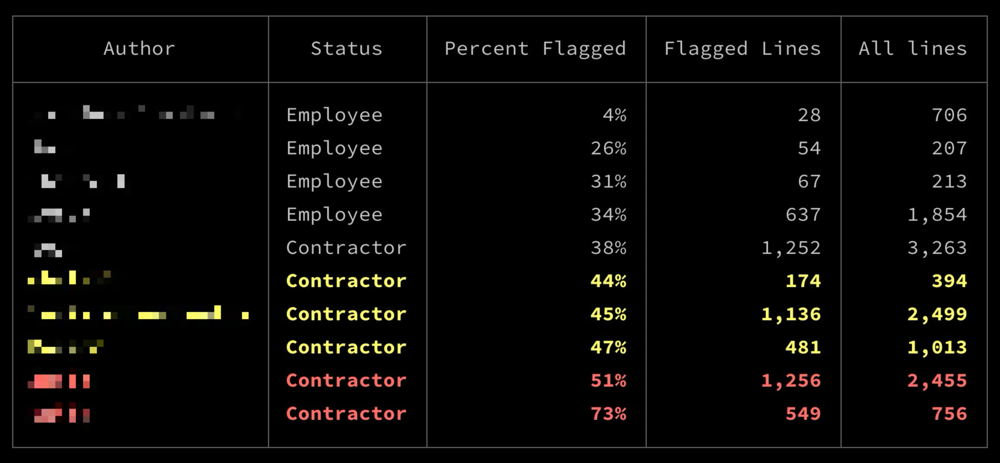
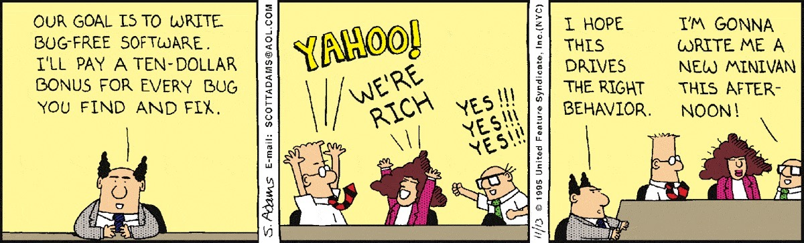

# Ruby Quality Report

## Installation

```sh
gem install quality_report
```

## Usage

Change to a project directory that contains `*.rb` files. Then:

```sh
ruby-quality-report
```

After a bit of a wait, it prints a table to stdout:



This is showing, for each contributor, the percentage of problematic lines of code in the repo. Lower is better.
I added the **Status** column data manually using the `--add-column` option:

```
Options:
  -c, --add-column JSON  Add a static column to the report. This is a simple
                         way to add known information. See the examples.
  -h, --help             Print this help
  -s, --skip AUTHOR      Filter out a git author

Examples:
  Append a column showing office location. The order of the keys in the JSON
  does not matter:
    $ ruby-quality-report -c '{"Location": {"Amy": "NYC", "Bob": "Remote"}}'

  Skip one author:
    $ ruby-quality-report --skip Cathy
```

### In Rails Projects

It works great in Rails projects. It examines code recursively starting in the current directory. In my testing,
I like the results best when run from `/app`. This is how I generated the report, above.

## Inspiration & Intent

I had a hunch that this was happening on a project I'm familiar with:



So I wrote this gem. As it turned out, there _was_ a measurable difference between staff and the consultants.

### I'm now using this as a management tool to:

- understand the quality of the code a team is producing,
- identify programmers who'd benefit from mentorship and education,
- reveal differences between different developer groups.


## How it works

It runs a subset of [Rubocop Metrics cops](https://docs.rubocop.org/rubocop/cops_metrics.html) on `*.rb` files that flag single lines or methods:

- [ABC Size](https://docs.rubocop.org/rubocop/cops_metrics.html#metricsabcsize)
- [Block Length](https://docs.rubocop.org/rubocop/cops_metrics.html#metricsblocklength)
- [Block Nesting](https://docs.rubocop.org/rubocop/cops_metrics.html#metricsblocknesting)
- [Cyclomatic Complexity](https://docs.rubocop.org/rubocop/cops_metrics.html#metricscyclomaticcomplexity)
- [Method Length](https://docs.rubocop.org/rubocop/cops_metrics.html#metricsmethodlength)
- [Perceived Complexity](https://docs.rubocop.org/rubocop/cops_metrics.html#metricsperceivedcomplexity)

Then, using git, it calculates the percentage of warnings per line written, per author. Each failing check is another warning.
### For improved relevance, it has two filters.

It excludes:

- authors with fewer than 200 lines of code
- authors with no commits in the previous 60 days


## Foundational Research

Diving a little deeper, I've seen the phenomenon of "micro-economies" of bug-creation and bug-fixing develop within teams. Some developers appear to be extremely productive. They create a lot of commits. But they also create a lot of bugs. Their productivity is illusory.

This code quality report doesn't track **bugs** per se. But it does report **quality and complexity**. Researchers have found a strong correlation between complexity and bug rate [1]. This link is reflected, _e.g.,_ in international safety standards that mandate low software complexity to reduce failures [2].

Complex code introduces bugs in a second, more subtle way. This is because code complexity is the killer of understandability. Studies have found that developers devote 64% of their time to understanding code, while only 5% is spent on actually modifying it [3].

1. De Silva, Dilshan, et al. The Relationship between Code Complexity and Software Quality: An Empirical Study. 2023, https://www.researchgate.net/publication/370761578_The_Relationship_between_Code_Complexity_and_Software_Quality_An_Empirical_Study.
2.  See e.g., ISO 26262-1:2018(En), Road Vehicles — Functional Safety — Part 1: Vocabulary. https://www.iso.org/obp/ui/en/#iso:std:iso:26262:-1:ed-2:v1:en. Accessed 29 Sept. 2024.
3.  Feitelson, Dror G. “From Code Complexity Metrics to Program Comprehension.” Communications of the ACM, vol. 66, no. 5, May 2023, pp. 52–61. DOI.org (Crossref), https://doi.org/10.1145/3546576.


## Roadmap

- [x] Colorize the output to separate high, medium, and low warning percentages.
- [x] Fix the numerical alignment.
- [x] --add-column option.
- [x] --skip option.
- [ ] Add a progress bar.
- [ ] Speed up the scan.
- [ ] Refactor from script-style coding to a more standard Ruby project.
- [ ] Make the filters configurable.
- [ ] Add a `--csv` option.
- [ ] Try using the git `email` attribute to automatically determine if an author is a team member or external.


## Contributing

Bug reports and pull requests are welcome on GitHub at https://github.com/dogweather/ruby-quality-report.
