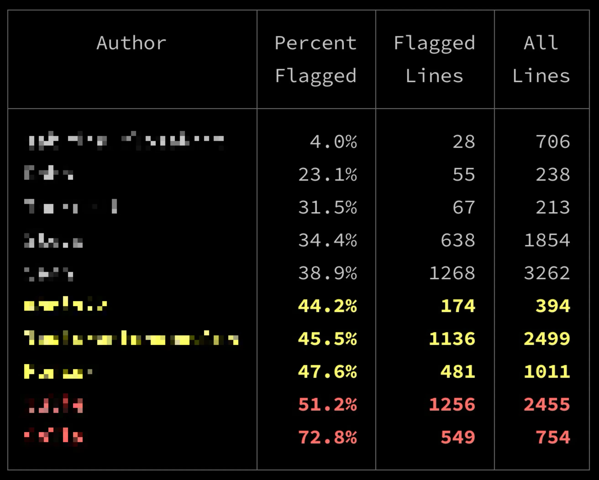

# Ruby Quality Report

## Installation

```sh
gem install quality-report
```

## Usage

```sh
ruby-quality-report
```

After a bit of a wait, it outputs a report in table form:



This is showing, for each author, the percentage of problematic lines of code. Lower is better.


### To improve the relevance, it has two filters.

It excludes:

- authors with fewer than 200 lines of code
- authors with no contributions in the previous 60 days


### In Rails Projects

This works in Rails projects too. It generates the report for the current directory and downwards. In my testing,
I like the results best when run from the `/app` directory. This is how I generated the report, above.


## How it works

It runs Rubocop code quality checks on `*.rb` files that flag single lines or methods. I.e., it skips checks that flag entire files.

- ABC Size
- Block Length
- Block Nesting
- Cyclomatic Complexity
- Method Length
- Perceived Complexity

It then calculates the percentage of lines flagged by each check, per author.


## Roadmap

- [ ] Colorize the output to separate high, medium, and low warning percentages.
- [ ] Fix the numerical alignment.
- [ ] Add a `--csv` option.
- [ ] Make the filters configurable.
- [ ] Speed up the scan.
- [ ] Add a progress bar.


## Contributing

Bug reports and pull requests are welcome on GitHub at https://github.com/dogweather/ruby-quality-report.
